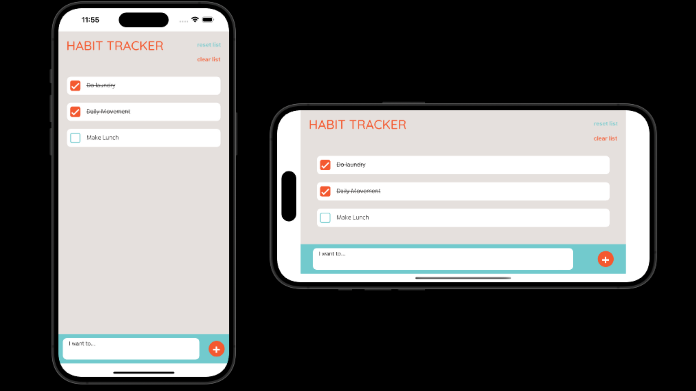

 

# habit-tracker-app

## Table of contents

- [Description](#Description)
- [Technologies](#Technologies)
- [Usage-Installation](#Usage-Installation)
- [Credits](#credits)

## Description

Habit Tracker is a simple mobile app that allows you to keep track of daily habits, to do lists, or whatever else you want to track in your life.

Add new tasks to your list in the add task input at the bottom of your screen and check them off when they're complete.
Did you make a mistake? Long press any task in your list to remove it.
Is your list a daily recurring list? Check each task off as completed, and reset the list each morning when you're ready to start again.

This app was build using React Native and Expo.

## Technologies

- React Native
- Expo

## Usage-Installation

This app is currently deployed on Expo. To view the deploted application you must have Expo App on your device.

Scan the QR code to open Habit Tracker using Expo.

OR, [open this link on your device](exp://exp.host/@amywilford/habit-tracker?release-channel=default)

## Credits

This application was designed and developed by Amy Wilford
